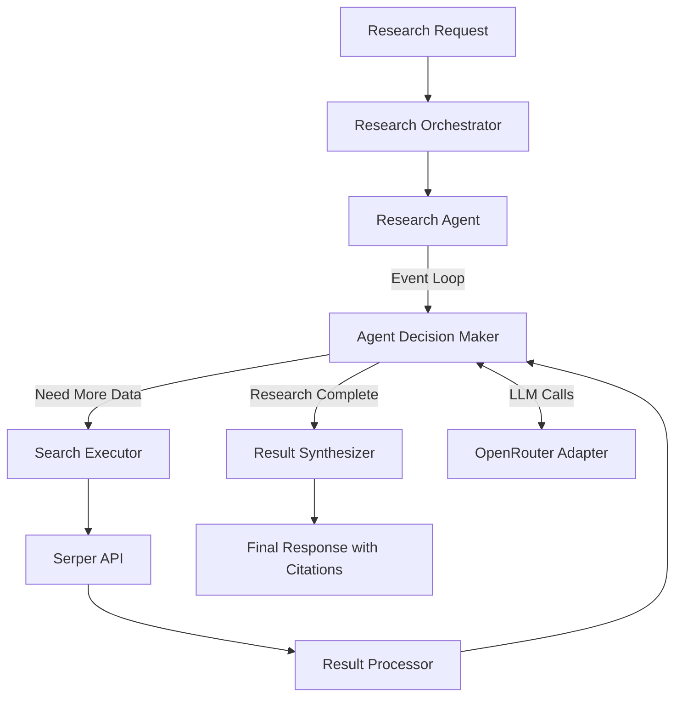

# Deep Research Agent Implementation Plan

This document outlines the detailed plan for implementing a Deep Research Agent as a tool in the serper-search-server. The implementation follows a domain-driven design approach with clear separation of concerns.

## Architecture Overview



This architecture implements an event loop where an AI agent, powered by OpenRouter, makes decisions about research steps, executes searches using the Serper API, processes results, and ultimately synthesizes a comprehensive research report with proper citations.

## Implementation Phases

### Phase 1: Environment Setup and Infrastructure Extensions
**Task 1.1: Extend Environment Configuration**
- Update `src/infrastructure/config/environment.ts` to include OpenRouter configuration
- Add research depth configuration settings

**Task 1.2: Create OpenRouter API Client**
- Create `src/infrastructure/api/openRouterClient.ts` to communicate with OpenRouter API
- Implement completion and chat completion methods

**Task 1.3: Setup Adapter Interface**
- Create adapters directory and LLM adapter interface
- Implement OpenRouter adapter

### Phase 2: Domain Layer Implementation
**Task 2.1: Define Research Domain Types**
- Create `src/domain/types/research.ts` with all necessary type definitions
- Implement interfaces for research requests, state, queries, and results

**Task 2.2: Implement Research Service**
- Create `src/domain/services/researchService.ts` for core research functionality
- Implement methods for research initiation, state management, and result synthesis

**Task 2.3: Implement Agent Service**
- Create `src/domain/services/agentService.ts` for agent decision making
- Implement methods for making decisions and generating sub-queries

**Task 2.4: Create Research Prompts**
- Create `src/domain/prompts/researchPrompts.ts` with well-crafted prompts
- Implement decision, sub-query generation, and synthesis prompts

### Phase 3: Application Layer Implementation
**Task 3.1: Implement Research Orchestrator**
- Create `src/application/orchestration/researchOrchestrator.ts`
- Implement the event loop for managing the research process

**Task 3.2: Define Research Tool Schema**
- Create `src/application/tools/schemas/researchToolSchema.ts`
- Define input schema and tool definition

**Task 3.3: Implement Research Tool Handler**
- Create `src/application/tools/handlers/researchToolHandler.ts`
- Implement request handling and result formatting

### Phase 4: Integration and Testing
**Task 4.1: Update Server Configuration**
- Update `src/server.ts` to register the new research tool
- Initialize all necessary services and orchestrators

**Task 4.2: Update .env.example and Documentation**
- Add OpenRouter API key requirements to `.env.example`
- Update documentation to explain the new tool

**Task 4.3: Testing**
- Test the deep research tool with various query types
- Validate citation generation and result synthesis

## Detailed Component Specifications

### Domain Types

```typescript
// src/domain/types/research.ts

/**
 * Main research request with query and optional parameters
 */
export interface ResearchRequest {
  query: string;
  depth?: 'basic' | 'standard' | 'deep';
  maxSources?: number;
}

/**
 * Internal state of the research process
 */
export interface ResearchState {
  originalQuery: string;
  subQueries: SubQuery[];
  searchResults: SearchResult[];
  completedSubQueries: string[];
  pendingSubQueries: string[];
  synthesizedResults?: string;
  citations: Citation[];
  status: 'in_progress' | 'complete';
}

/**
 * Represents a decomposed query for focused research
 */
export interface SubQuery {
  id: string;
  query: string;
  rationale: string;
  status: 'pending' | 'completed' | 'failed';
}

/**
 * Results from a search operation
 */
export interface SearchResult {
  query: string;
  results: SerperResponse;
  timestamp: number;
}

/**
 * Citation information for a source
 */
export interface Citation {
  id: string;
  title: string;
  url: string;
  snippet: string;
  relevanceScore: number;
}

/**
 * Final research result format
 */
export interface ResearchResult {
  answer: string;
  citations: Citation[];
  subQueriesGenerated: number;
  subQueriesCompleted: number;
  searchesPerformed: number;
}

/**
 * Agent decision returned by the LLM
 */
export interface AgentDecision {
  action: 'search' | 'generate_subqueries' | 'research_complete';
  query?: string;
  rationale: string;
}
```

### Infrastructure Extensions

```typescript
// src/infrastructure/config/environment.ts - Extended version

/**
 * Environment configuration and validation
 */
import * as dotenv from 'dotenv';
import { fileURLToPath } from 'url';
import { dirname, resolve } from 'path';

// Get the directory path for loading the .env file
const __filename = fileURLToPath(import.meta.url);
const __dirname = dirname(__filename);
const rootDir = resolve(__dirname, '../../../..');

// Load environment variables from .env file
dotenv.config({ path: resolve(rootDir, '.env') });

// Configuration constants
export const RATE_LIMIT = 50; // requests per minute
export const RATE_WINDOW = 60000; // 1 minute in milliseconds
export const REQUEST_TIMEOUT = 10000; // 10 seconds

// Environment variable validation
const getRequiredEnv = (key: string): string => {
  const value = process.env[key];
  if (!value) {
    throw new Error(`${key} environment variable is required. Please set it in your configuration.`);
  }
  return value;
};

// Export config values
export const config = {
  serperApiKey: getRequiredEnv('SERPER_API_KEY'),
  serperApiUrl: 'https://google.serper.dev',
  
  // OpenRouter config
  openRouterApiKey: getRequiredEnv('OPENROUTER_API_KEY'),
  openRouterModel: process.env.OPENROUTER_MODEL || 'google/gemini-2.0-flash-001',
  openRouterUrl: 'https://openrouter.ai/api/v1',
  
  // Research depth settings
  researchDepthSettings: {
    basic: { 
      maxSubQueries: 3, 
      maxSearchesPerQuery: 1,
      temperature: 0.7
    },
    standard: { 
      maxSubQueries: 5, 
      maxSearchesPerQuery: 2,
      temperature: 0.5
    },
    deep: { 
      maxSubQueries: 10, 
      maxSearchesPerQuery: 3,
      temperature: 0.3
    }
  }
};
```

```typescript
// src/infrastructure/api/openRouterClient.ts

/**
 * OpenRouter API client for LLM operations
 */
import axios, { AxiosInstance, AxiosError } from 'axios';
import { config, REQUEST_TIMEOUT } from '../config/environment.js';
import { ErrorCode, McpError } from '@modelcontextprotocol/sdk/types.js';

export interface ChatMessage {
  role: 'system' | 'user' | 'assistant';
  content: string;
}

export interface CompletionOptions {
  temperature?: number;
  maxTokens?: number;
  stop?: string[];
}

export interface ChatCompletionOptions extends CompletionOptions {
  topP?: number;
  frequencyPenalty?: number;
  presencePenalty?: number;
}

export interface ChatResponse {
  id: string;
  model: string;
  choices: {
    message: ChatMessage;
    finishReason: string;
  }[];
}

export interface OpenRouterConfig {
  apiKey: string;
  model: string;
  baseUrl: string;
}

export class OpenRouterClient {
  private axiosInstance: AxiosInstance;
  private model: string;

  constructor(openRouterConfig: OpenRouterConfig) {
    this.model = openRouterConfig.model;
    
    this.axiosInstance = axios.create({
      baseURL: openRouterConfig.baseUrl,
      headers: {
        'Authorization': `Bearer ${openRouterConfig.apiKey}`,
        'Content-Type': 'application/json',
        'HTTP-Referer': 'https://serper-search-server',
        'X-Title': 'Serper Search Deep Research'
      },
      timeout: REQUEST_TIMEOUT,
    });
  }

  /**
   * Generates a completion from the provided prompt
   */
  async completion(prompt: string, options?: CompletionOptions): Promise<string> {
    try {
      const response = await this.axiosInstance.post('/completions', {
        model: this.model,
        prompt,
        temperature: options?.temperature ?? 0.5,
        max_tokens: options?.maxTokens ?? 1024,
        stop: options?.stop
      });

      return response.data.choices[0].text;
    } catch (error) {
      this.handleApiError(error);
      throw error; // This line won't be reached but TypeScript needs it
    }
  }

  /**
   * Generates a chat completion from the provided messages
   */
  async chatCompletion(messages: ChatMessage[], options?: ChatCompletionOptions): Promise<ChatResponse> {
    try {
      const response = await this.axiosInstance.post('/chat/completions', {
        model: this.model,
        messages,
        temperature: options?.temperature ?? 0.5,
        max_tokens: options?.maxTokens ?? 1024,
        top_p: options?.topP ?? 0.9,
        frequency_penalty: options?.frequencyPenalty ?? 0,
        presence_penalty: options?.presencePenalty ?? 0,
        stop: options?.stop
      });

      return response.data;
    } catch (error) {
      this.handleApiError(error);
      throw error; // This line won't be reached but TypeScript needs it
    }
  }

  /**
   * Handles API errors and transforms them into McpErrors
   */
  private handleApiError(error: any): never {
    if (axios.isAxiosError(error)) {
      const axiosError = error as AxiosError;
      throw new McpError(
        ErrorCode.InternalError,
        `OpenRouter API error: ${
          (axiosError.response?.data as any)?.error?.message ?? axiosError.message
        }`
      );
    }

    throw new McpError(
      ErrorCode.InternalError,
      `Unexpected error: ${(error as Error).message}`
    );
  }
}
```

### LLM Adapter

```typescript
// src/adapters/llm/llmAdapter.ts

/**
 * Interface for LLM adapters
 */
import { ChatMessage, CompletionOptions, ChatCompletionOptions, ChatResponse } from '../../infrastructure/api/openRouterClient.js';

export interface LLMAdapter {
  generateCompletion(prompt: string, options?: CompletionOptions): Promise<string>;
  generateChatCompletion(messages: ChatMessage[], options?: ChatCompletionOptions): Promise<ChatResponse>;
}
```

```typescript
// src/adapters/llm/openRouterAdapter.ts

/**
 * OpenRouter implementation of the LLM adapter
 */
import { OpenRouterClient, ChatMessage, CompletionOptions, ChatCompletionOptions, ChatResponse } from '../../infrastructure/api/openRouterClient.js';
import { LLMAdapter } from './llmAdapter.js';

export class OpenRouterAdapter implements LLMAdapter {
  private client: OpenRouterClient;
  
  constructor(client: OpenRouterClient) {
    this.client = client;
  }
  
  async generateCompletion(prompt: string, options?: CompletionOptions): Promise<string> {
    return this.client.completion(prompt, options);
  }
  
  async generateChatCompletion(messages: ChatMessage[], options?: ChatCompletionOptions): Promise<ChatResponse> {
    return this.client.chatCompletion(messages, options);
  }
}
```

### Research Prompts

```typescript
// src/domain/prompts/researchPrompts.ts

/**
 * Well-crafted prompts for research agent operations
 */

/**
 * Prompt for agent decision making
 */
export const DECISION_PROMPT = `
You are a sophisticated research agent responsible for deciding the next steps in a research process.

Current Research State:
- Original Query: {{originalQuery}}
- Completed Searches: {{completedSearches}}
- Pending Sub-Queries: {{pendingSubQueries}}
- Search Results Obtained So Far:
{{searchResultsSummary}}

Based on this information, decide what to do next:
1. "search" - Execute a search for more information (provide the exact query)
2. "generate_subqueries" - Generate more specific sub-queries to explore
3. "research_complete" - Conclude the research and synthesize findings

Your decision must be in JSON format:
{
  "action": "search|generate_subqueries|research_complete",
  "query": "specific search query if action is search",
  "rationale": "explain your reasoning for this decision"
}
`;

/**
 * Prompt for generating sub-queries
 */
export const SUBQUERY_GENERATION_PROMPT = `
As a research specialist, your task is to break down the following research query into specific sub-questions that will help gather comprehensive information:

Research Query: {{originalQuery}}

Generate {{numSubQueries}} sub-queries that:
- Cover different aspects of the main query
- Are specific and focused
- Would yield useful information for answering the original query
- Are formatted for search engines

For each sub-query, explain why it's important to the overall research.

Format your response as JSON:
{
  "subQueries": [
    {
      "query": "specific sub-query 1",
      "rationale": "why this is important to research"
    },
    ...
  ]
}
`;

/**
 * Prompt for synthesizing research results
 */
export const SYNTHESIS_PROMPT = `
As a research analyst, synthesize the following search results into a comprehensive, well-structured response.

Original Research Query: {{originalQuery}}

Search Results:
{{formattedSearchResults}}

Your task:
1. Synthesize these findings into a cohesive, informative response
2. Ensure all key information is included
3. Structure the response logically
4. Include proper citations for all information
5. Highlight areas where information might be incomplete or contradictory

Format your response with:
- Clear section headings
- Numbered citations in [brackets] pointing to the source list
- A final list of all sources used, numbered to match your citations
`;
```

### Domain Services

```typescript
// src/domain/services/agentService.ts

/**
 * Service for agent decision making and sub-query generation
 */
import { v4 as uuidv4 } from 'uuid';
import { LLMAdapter } from '../../adapters/llm/llmAdapter.js';
import { DECISION_PROMPT, SUBQUERY_GENERATION_PROMPT } from '../prompts/researchPrompts.js';
import { ResearchState, AgentDecision, SubQuery } from '../types/research.js';
import { config } from '../../infrastructure/config/environment.js';

export class AgentService {
  /**
   * Makes a decision about the next research step
   */
  async makeDecision(state: ResearchState, llmAdapter: LLMAdapter): Promise<AgentDecision> {
    // Replace template variables in the prompt
    const filledPrompt = DECISION_PROMPT
      .replace('{{originalQuery}}', state.originalQuery)
      .replace('{{completedSearches}}', state.completedSubQueries.join('\n- '))
      .replace('{{pendingSubQueries}}', state.pendingSubQueries.join('\n- '))
      .replace('{{searchResultsSummary}}', this.formatSearchResultsSummary(state));
    
    // Request decision from LLM
    const decisionText = await llmAdapter.generateCompletion(filledPrompt, {
      temperature: 0.2, // Low temperature for more deterministic responses
      maxTokens: 500
    });
    
    try {
      // Parse the JSON response
      const decision = JSON.parse(decisionText) as AgentDecision;
      
      // Validate the decision
      if (!['search', 'generate_subqueries', 'research_complete'].includes(decision.action)) {
        throw new Error(`Invalid action: ${decision.action}`);
      }
      
      if (decision.action === 'search' && !decision.query) {
        throw new Error('Search action requires a query');
      }
      
      return decision;
    } catch (error) {
      console.error('Failed to parse agent decision:', error);
      
      // Fallback decision if parsing fails
      return {
        action: state.searchResults.length > 0 ? 'research_complete' : 'search',
        query: state.originalQuery,
        rationale: 'Fallback decision due to parsing error'
      };
    }
  }
  
  /**
   * Generates sub-queries for the research
   */
  async generateSubQueries(query: string, llmAdapter: LLMAdapter, depth: 'basic' | 'standard' | 'deep' = 'standard'): Promise<SubQuery[]> {
    const depthSettings = config.researchDepthSettings[depth];
    const numSubQueries = depthSettings.maxSubQueries;
    
    // Replace template variables in the prompt
    const filledPrompt = SUBQUERY_GENERATION_PROMPT
      .replace('{{originalQuery}}', query)
      .replace('{{numSubQueries}}', numSubQueries.toString());
    
    // Request sub-queries from LLM
    const subQueriesText = await llmAdapter.generateCompletion(filledPrompt, {
      temperature: 0.7, // Higher temperature for more diverse sub-queries
      maxTokens: 1000
    });
    
    try {
      // Parse the JSON response
      const response = JSON.parse(subQueriesText) as { subQueries: Array<{ query: string, rationale: string }> };
      
      // Convert to SubQuery objects with IDs
      return response.subQueries.map(sq => ({
        id: uuidv4(),
        query: sq.query,
        rationale: sq.rationale,
        status: 'pending'
      }));
    } catch (error) {
      console.error('Failed to parse sub-queries:', error);
      
      // Fallback: generate a single sub-query
      return [{
        id: uuidv4(),
        query,
        rationale: 'Direct search of the original query due to parsing error',
        status: 'pending'
      }];
    }
  }
  
  /**
   * Formats search results for prompt inclusion
   */
  private formatSearchResultsSummary(state: ResearchState): string {
    if (state.searchResults.length === 0) {
      return 'No search results yet.';
    }
    
    return state.searchResults.map(result => {
      const organicResults = result.results.organic || [];
      const snippets = organicResults
        .slice(0, 3)
        .map(r => `- ${r.title}: ${r.snippet}`)
        .join('\n');
      
      return `Search for "${result.query}":\n${snippets}\n`;
    }).join('\n');
  }
}
```

```typescript
// src/domain/services/researchService.ts

/**
 * Core research service with main business logic
 */
import { v4 as uuidv4 } from 'uuid';
import { LLMAdapter } from '../../adapters/llm/llmAdapter.js';
import { SYNTHESIS_PROMPT } from '../prompts/researchPrompts.js';
import { 
  ResearchRequest, 
  ResearchState, 
  SearchResult,
  ResearchResult,
  AgentDecision,
  Citation
} from '../types/research.js';

export class ResearchService {
  /**
   * Initializes a new research state
   */
  initializeState(request: ResearchRequest): ResearchState {
    return {
      originalQuery: request.query,
      subQueries: [],
      searchResults: [],
      completedSubQueries: [],
      pendingSubQueries: [],
      citations: [],
      status: 'in_progress'
    };
  }
  
  /**
   * Updates state based on agent decision
   */
  async processAgentDecision(
    state: ResearchState, 
    decision: AgentDecision
  ): Promise<ResearchState> {
    // Clone state to avoid direct mutations
    const newState = { ...state };
    
    if (decision.action === 'research_complete') {
      newState.status = 'complete';
    }
    
    return newState;
  }
  
  /**
   * Updates state with new search results
   */
  updateStateWithResults(
    state: ResearchState, 
    query: string, 
    results: any
  ): ResearchState {
    // Clone state to avoid direct mutations
    const newState = { ...state };
    
    // Add new search result
    newState.searchResults.push({
      query,
      results,
      timestamp: Date.now()
    });
    
    // Update completed queries
    if (!newState.completedSubQueries.includes(query)) {
      newState.completedSubQueries.push(query);
    }
    
    // Remove from pending queries if present
    newState.pendingSubQueries = newState.pendingSubQueries.filter(q => q !== query);
    
    // Extract citations from results
    const newCitations = this.extractCitationsFromResults(query, results);
    newState.citations = [...newState.citations, ...newCitations];
    
    return newState;
  }
  
  /**
   * Updates state with new sub-queries
   */
  updateStateWithSubQueries(
    state: ResearchState, 
    subQueries: Array<{ query: string, rationale: string }>
  ): ResearchState {
    // Clone state to avoid direct mutations
    const newState = { ...state };
    
    // Add sub-queries that aren't already in the state
    const existingQueries = new Set([
      ...newState.completedSubQueries,
      ...newState.pendingSubQueries
    ]);
    
    subQueries.forEach(sq => {
      if (!existingQueries.has(sq.query)) {
        newState.pendingSubQueries.push(sq.query);
        newState.subQueries.push({
          id: uuidv4(),
          query: sq.query,
          rationale: sq.rationale,
          status: 'pending'
        });
      }
    });
    
    return newState;
  }
  
  /**
   * Synthesizes final research results
   */
  async synthesizeResults(
    state: ResearchState,
    llmAdapter: LLMAdapter
  ): Promise<ResearchResult> {
    // Format search results for the synthesis prompt
    const formattedResults = this.formatSearchResultsForSynthesis(state);
    
    // Replace template variables in the prompt
    const filledPrompt = SYNTHESIS_PROMPT
      .replace('{{originalQuery}}', state.originalQuery)
      .replace('{{formattedSearchResults}}', formattedResults);
    
    // Request synthesis from LLM
    const synthesisText = await llmAdapter.generateCompletion(filledPrompt, {
      temperature: 0.3,
      maxTokens: 2000
    });
    
    return {
      answer: synthesisText,
      citations: state.citations,
      subQueriesGenerated: state.subQueries.length,
      subQueriesCompleted: state.completedSubQueries.length,
      searchesPerformed: state.searchResults.length
    };
  }
  
  /**
   * Extracts citations from search results
   */
  private extractCitationsFromResults(query: string, results: any): Citation[] {
    const citations: Citation[] = [];
    
    if (results.organic && Array.isArray(results.organic)) {
      results.organic.forEach((result: any, index: number) => {
        citations.push({
          id: uuidv4(),
          title: result.title || 'Unknown Title',
          url: result.link || '',
          snippet: result.snippet || '',
          relevanceScore: 1 - (index * 0.1) // Simple relevance score based on position
        });
      });
    }
    
    return citations;
  }
  
  /**
   * Formats search results for synthesis prompt
   */
  private formatSearchResultsForSynthesis(state: ResearchState): string {
    if (state.searchResults.length === 0) {
      return 'No search results available.';
    }
    
    return state.searchResults.map((result, index) => {
      const organicResults = result.results.organic || [];
      const formattedResults = organicResults
        .slice(0, 5)
        .map((r, i) => {
          const resultNum = index * 5 + i + 1;
          return `[${resultNum}] ${r.title}\nURL: ${r.link}\nSnippet: ${r.snippet}\n`;
        })
        .join('\n');
      
      return `## Results for "${result.query}":\n${formattedResults}`;
    }).join('\n\n');
  }
}
```

### Research Orchestrator

```typescript
// src/application/orchestration/researchOrchestrator.ts

/**
 * Orchestrates the research process with an event loop
 */
import { ResearchService } from '../../domain/services/researchService.js';
import { AgentService } from '../../domain/services/agentService.js';
import { SearchService } from '../../domain/services/searchService.js';
import { LLMAdapter } from '../../adapters/llm/llmAdapter.js';
import { 
  ResearchRequest, 
  ResearchState, 
  ResearchResult
} from '../../domain/types/research.js';
import { config } from '../../infrastructure/config/environment.js';
import { ErrorCode, McpError } from '@modelcontextprotocol/sdk/types.js';

export class ResearchOrchestrator {
  private researchService: ResearchService;
  private agentService: AgentService;
  private searchService: SearchService;
  private llmAdapter: LLMAdapter;
  
  constructor(
    researchService: ResearchService,
    agentService: AgentService,
    searchService: SearchService,
    llmAdapter: LLMAdapter
  ) {
    this.researchService = researchService;
    this.agentService = agentService;
    this.searchService = searchService;
    this.llmAdapter = llmAdapter;
  }
  
  /**
   * Main method to execute the research process
   */
  async executeResearch(request: ResearchRequest): Promise<ResearchResult> {
    // Validate request
    this.validateRequest(request);
    
    // Initialize research state
    let state: ResearchState = this.researchService.initializeState(request);
    let iterationCount = 0;
    const maxIterations = this.getMaxIterations(request.depth || 'standard');
    
    // Begin event loop
    while (state.status !== 'complete' && iterationCount < maxIterations) {
      iterationCount++;
      console.log(`Research iteration ${iterationCount}/${maxIterations}`);
      
      try {
        // If no queries pending and no subqueries generated yet, generate initial subqueries
        if (state.pendingSubQueries.length === 0 && state.subQueries.length === 0) {
          const subQueries = await this.agentService.generateSubQueries(
            request.query,
            this.llmAdapter,
            request.depth
          );
          state = this.researchService.updateStateWithSubQueries(
            state,
            subQueries.map(sq => ({ query: sq.query, rationale: sq.rationale }))
          );
          continue;
        }
        
        // If there are pending queries, execute one
        if (state.pendingSubQueries.length > 0) {
          const query = state.pendingSubQueries[0];
          const results = await this.searchService.performSearch({ query });
          state = this.researchService.updateStateWithResults(state, query, results);
          continue;
        }
        
        // Get agent decision via LLM
        const decision = await this.agentService.makeDecision(state, this.llmAdapter);
        
        if (decision.action === 'search' && decision.query) {
          // Execute search
          const results = await this.searchService.performSearch({ query: decision.query });
          state = this.researchService.updateStateWithResults(state, decision.query, results);
        } 
        else if (decision.action === 'generate_subqueries') {
          // Generate new search queries
          const subQueries = await this.agentService.generateSubQueries(
            request.query,
            this.llmAdapter,
            request.depth
          );
          state = this.researchService.updateStateWithSubQueries(
            state,
            subQueries.map(sq => ({ query: sq.query, rationale: sq.rationale }))
          );
        }
        else if (decision.action === 'research_complete') {
          // Synthesize final results
          state.status = 'complete';
        }
      } catch (error) {
        console.error(`Error in research iteration ${iterationCount}:`, error);
        
        // If we have some results, proceed with synthesis despite the error
        if (state.searchResults.length > 0) {
          state.status = 'complete';
          break;
        } else {
          throw new McpError(
            ErrorCode.InternalError,
            `Research failed: ${(error as Error).message}`
          );
        }
      }
    }
    
    // If we hit max iterations, force completion
    if (state.status !== 'complete') {
      state.status = 'complete';
    }
    
    // Synthesize the final result
    return this.researchService.synthesizeResults(state, this.llmAdapter);
  }
  
  /**
   * Validates the research request
   */
  private validateRequest(request: ResearchRequest): void {
    if (!request.query || request.query.trim().length === 0) {
      throw new McpError(ErrorCode.InvalidParams, 'Query must be non-empty');
    }
    
    if (request.depth && !['basic', 'standard', 'deep'].includes(request.depth)) {
      throw new McpError(ErrorCode.InvalidParams, 'Depth must be one of: basic, standard, deep');
    }
    
    if (request.maxSources && (typeof request.maxSources !== 'number' || request.maxSources < 1)) {
      throw new McpError(ErrorCode.InvalidParams, 'maxSources must be a positive number');
    }
  }
  
  /**
   * Gets
